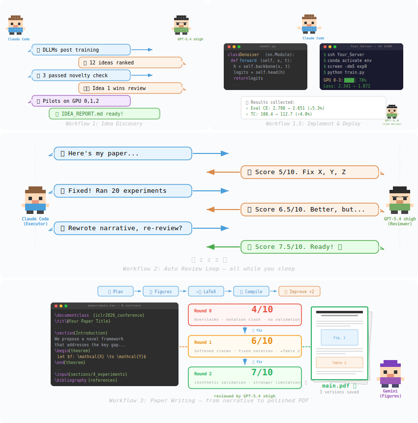

# Auto-claude-code-research-in-sleep (ARIS ⚔️)

[中文版 README](README_CN.md) | English




> 🌙 **Let Claude Code do research while you sleep.** Wake up to find your paper scored, weaknesses identified, experiments run, and narrative rewritten — autonomously.

Custom [Claude Code](https://docs.anthropic.com/en/docs/claude-code) skills for autonomous ML research workflows. These skills orchestrate **cross-model collaboration** — Claude Code drives the research while an external LLM (via [Codex MCP](https://github.com/openai/codex)) acts as a critical reviewer.

## 📈 Score Progression (Real Run)

A real overnight 4-round run on an ML research project, from borderline reject to submission-ready:

| Round | Score | What Happened |
|-------|-------|---------------|
| Initial | 5.0/10 | Borderline reject |
| Round 1 | 6.5/10 | Added standard metrics, discovered metric decoupling |
| Round 2 | 6.8/10 | Key claim failed to reproduce, pivoted narrative |
| Round 3 | 7.0/10 | Large seed study killed main improvement claim |
| Round 4 | **7.5/10** ✅ | Diagnostic evidence solidified, **submission ready** |

The loop autonomously ran **20+ GPU experiments**, rewrote the paper's narrative framing, and killed claims that didn't hold up — all without human intervention.

## 💡 Idea Discovery (New)

Don't have a concrete idea yet? Just give a research direction — `/idea-creator` handles the rest:

1. 📚 **Survey** the landscape (recent papers, open problems, recurring limitations)
2. 🧠 **Brainstorm** 8-12 concrete ideas via GPT-5.4 xhigh
3. 🔍 **Filter** by feasibility, compute cost, and quick novelty search
4. 🛡️ **Validate** top ideas with deep novelty check + devil's advocate review
5. 🧪 **Pilot** top 2-3 ideas in parallel on different GPUs (30 min - 2 hr each)
6. 🏆 **Rank** by empirical signal — ideas with positive pilot results rise to the top

The output is a ranked `IDEA_REPORT.md` with hypotheses, pilot results, reviewer objections, and a suggested execution order. Ideas that fail are documented too, saving future dead-end exploration.

---

## 🔄 Workflows

These skills compose into a full research lifecycle. The two workflows can be used independently or chained together:

- **Exploring a new area (e.g., writing a survey)?** Start with Workflow 1 → `/idea-discovery`
- **Already have an idea + initial plan?** Jump straight to Workflow 2 → `/auto-review-loop`
- **Full pipeline?** Workflow 1 → Workflow 2 → `/research-pipeline` — from literature survey all the way to submission

> ⚠️ **Important:** These tools accelerate research, but they don't replace your own critical thinking. Always review generated ideas with your domain expertise, question the assumptions, and make the final call yourself. The best research comes from human insight + AI execution, not full autopilot.

### Full Pipeline 🚀

```
/research-lit → /idea-creator → /novelty-check → implement → /run-experiment → /auto-review-loop → submit
  (survey)      (brainstorm)    (verify novel)    (code)      (deploy & run)    (review & fix)     (done!)
  ├──── Workflow 1: Idea Discovery ────┤              ├──────── Workflow 2: Auto Loop ────────┤
```

📝 **Blog post:** [梦中科研全流程开源](http://xhslink.com/o/2iV33fYoc7Q)

### Workflow 1: Literature & Idea Discovery 🔍

> **"What's the state of the art? Where are the gaps?"**

```
┌─────────────────────────────────────────────────────────────┐
│                  Idea Discovery                              │
│                                                              │
│   /research-lit     /idea-creator     /novelty-check         │
│   (find papers)     (brainstorm)      (verify novelty)       │
│         │                │                  │                │
│         ▼                ▼                  ▼                │
│   ┌──────────┐     ┌──────────┐       ┌──────────┐         │
│   │ Search   │────▶│ Generate │──────▶│ Check if │         │
│   │ arXiv,   │     │ 8-12     │       │ idea is  │         │
│   │ Scholar  │     │ ideas    │       │ novel    │         │
│   │ for gaps │     │ + rank   │       │          │         │
│   └──────────┘     └──────────┘       └──────────┘         │
│                          │                  │                │
│                          ▼                  ▼                │
│                    ┌──────────┐       ┌──────────┐         │
│                    │ Filter   │──────▶│ External │         │
│                    │ by cost, │       │ LLM      │         │
│                    │ novelty  │       │ evaluates│         │
│                    └──────────┘       └──────────┘         │
│                                                              │
│   Typical flow:                                              │
│   1. /research-lit "discrete diffusion models"               │
│   2. /idea-creator "DLLMs post training"               │
│   3. Review ranked ideas, pick top 2-3                       │
│   4. /novelty-check "top idea" (deep verification)           │
│   5. /research-review "top idea" (critical feedback)         │
│   6. Implement → /run-experiment → /auto-review-loop         │
└─────────────────────────────────────────────────────────────┘
```

**Skills involved:** `research-lit` + `idea-creator` + `novelty-check` + `research-review`

> 💡 **One-command shortcut:** `/idea-discovery "your research direction"` runs this entire workflow automatically.

📝 **Blog post:** [Claude Code 两月 NeurIPS 指北](http://xhslink.com/o/7IvAJQ41IBA)

### Workflow 2: Auto Research Loop 🔁 (sleep & wake up to results)

> **"Review my paper, fix what's wrong, repeat until it's good."**

```
┌─────────────────────────────────────────────────────────────┐
│                    Auto Review Loop                          │
│                                                              │
│   /research-review          /auto-review-loop                │
│   (single deep review)      (autonomous loop)                │
│         │                         │                          │
│         ▼                         ▼                          │
│   ┌──────────┐   ┌──────────┐   ┌──────────┐               │
│   │ External  │──▶│ Implement│──▶│ Monitor  │──▶ repeat     │
│   │ LLM      │   │ fixes    │   │ results  │    until       │
│   │ reviews  │   │ & run    │   │          │    score ≥ 6   │
│   └──────────┘   │ experiments│  └──────────┘               │
│                   └──────────┘                               │
│                                                              │
│   When reviewer suggests a new method direction:             │
│   /novelty-check — verify idea isn't already published       │
│                                                              │
│   Supporting skills:                                         │
│   /run-experiment    — deploy to local/remote GPU            │
│   /analyze-results   — interpret experiment outputs          │
│   /monitor-experiment — check progress, collect results      │
└─────────────────────────────────────────────────────────────┘
```

**Skills involved:** `auto-review-loop` + `research-review` + `novelty-check` + `run-experiment` + `analyze-results` + `monitor-experiment`

> 💡 **One-command shortcut:** `/auto-review-loop "your paper topic"` runs this entire workflow automatically.

**🛡️ Key safety features:**

- 🔒 **MAX_ROUNDS = 4** — prevents infinite loops; stops early if score threshold is met
- ⏱️ **> 4 GPU-hour experiments skipped** — won't launch massive jobs; flags them for manual follow-up
- 🧠 **Prefer reframing over new experiments** — when both can address a weakness, chooses the cheaper path
- 🪞 **No hiding weaknesses** — explicit rule: "Do NOT hide weaknesses to game a positive score"
- 🔧 **Fix before re-review** — must actually implement fixes before resubmitting; no empty promises

📝 **Blog post:** [开源 | 睡觉 Claude 自动跑实验改文](http://xhslink.com/o/5cBMTDigNXz)

---

## 🧰 All Skills

| Skill | Description | Needs Codex MCP? |
|-------|-------------|-----------------|
| 💡 [`idea-creator`](skills/idea-creator/SKILL.md) | Generate and rank research ideas given a broad direction (brainstorm + filter + validate) | Yes |
| 🔬 [`research-review`](skills/research-review/SKILL.md) | Single-round deep review from external LLM (xhigh reasoning) | Yes |
| 🔁 [`auto-review-loop`](skills/auto-review-loop/SKILL.md) | Autonomous multi-round review→fix→re-review loop (max 4 rounds) | Yes |
| 📚 [`research-lit`](skills/research-lit/SKILL.md) | Search papers, analyze related work, find research gaps | No |
| 📊 [`analyze-results`](skills/analyze-results/SKILL.md) | Analyze experiment results, compute statistics, generate insights | No |
| 👀 [`monitor-experiment`](skills/monitor-experiment/SKILL.md) | Monitor running experiments, check progress, collect results | No |
| 🔍 [`novelty-check`](skills/novelty-check/SKILL.md) | Verify research idea novelty against recent literature before implementing | Yes |
| 🚀 [`run-experiment`](skills/run-experiment/SKILL.md) | Deploy experiments to local (MPS/CUDA) or remote GPU servers | No |
| 🎨 [`pixel-art`](skills/pixel-art/SKILL.md) | Generate pixel art SVG illustrations for READMEs, docs, or slides | No |
| 🔭 [`idea-discovery`](skills/idea-discovery/SKILL.md) | **Workflow 1 pipeline**: research-lit → idea-creator → novelty-check → research-review | Yes |
| 🏗️ [`research-pipeline`](skills/research-pipeline/SKILL.md) | **Full pipeline**: Workflow 1 → implement → Workflow 2, from direction to submission | Yes |

---

## ⚙️ Setup

### Prerequisites

1. [Claude Code](https://docs.anthropic.com/en/docs/claude-code) installed
2. (For review skills) [Codex CLI](https://github.com/openai/codex) installed and configured as MCP server:
   ```bash
   npm install -g @openai/codex
   claude mcp add codex -s user -- codex mcp-server
   ```

### Install Skills

```bash
git clone https://github.com/wanshuiyin/Auto-claude-code-research-in-sleep.git
cd Auto-claude-code-research-in-sleep

# Install all skills globally
cp -r skills/* ~/.claude/skills/

# Or install specific skills
cp -r skills/auto-review-loop ~/.claude/skills/
cp -r skills/research-lit ~/.claude/skills/
```

### Usage

```
> /idea-creator DLLMs post training
> /research-lit discrete diffusion language models
> /research-review my paper on training dynamics in D-LLMs
> /auto-review-loop ML paper on factorized gap diagnosis
> /run-experiment train.py --lr 1e-4 --epochs 100
> /analyze-results figures/*.json
> /monitor-experiment server5
> /idea-discovery discrete diffusion language models
> /research-pipeline DLLMs post training
```

### 🌙 Auto-Allow for Overnight Runs (Optional)

To run the auto-review loop without clicking permission prompts, add to `.claude/settings.local.json`:

```json
{
  "permissions": {
    "allow": [
      "mcp__codex__codex",
      "mcp__codex__codex-reply",
      "Write",
      "Edit",
      "Skill(auto-review-loop)"
    ]
  }
}
```

### 🖥️ GPU Server Setup (For Auto-Experiments)

When GPT-5.4 says "run an ablation study" or "add a baseline comparison", Claude Code automatically writes the experiment script and deploys it to your GPU server. For this to work, Claude Code needs to know your server environment.

Add your server info to your project's `CLAUDE.md`:

```markdown
## Remote Server

- SSH: `ssh my-gpu-server` (key-based auth, no password)
- GPU: 4x A100
- Conda env: `research` (Python 3.10 + PyTorch)
- Activate: `eval "$(/opt/conda/bin/conda shell.bash hook)" && conda activate research`
- Code directory: `/home/user/experiments/`
- Use `screen` for background jobs: `screen -dmS exp0 bash -c '...'`
```

Claude Code reads this and knows how to SSH in, activate the environment, and launch experiments. GPT-5.4 (the reviewer) only decides **what** experiments to run — Claude Code figures out **how** based on your `CLAUDE.md`.

**No server?** The review and rewriting skills still work without GPU access. Only experiment-related fixes will be skipped (flagged for manual follow-up).

## 🏗️ How It Works

```
┌─────────────────────────────────────────────────┐
│                 Claude Code                      │
│                                                  │
│  ┌──────────┐    ┌──────────┐    ┌──────────┐   │
│  │  Read     │    │  Write   │    │  SSH to  │   │
│  │  project  │───▶│  code &  │───▶│  GPU     │   │
│  │  context  │    │  scripts │    │  server  │   │
│  └──────────┘    └──────────┘    └──────────┘   │
│       │                               │          │
│       ▼                               ▼          │
│  ┌──────────────────────────────────────────┐    │
│  │         Codex MCP (External LLM)         │    │
│  │                                          │    │
│  │  Round 1: "Score 5/10. Weaknesses: ..."  │    │
│  │  Round 2: "Score 6.5. Better, but ..."   │    │
│  │  Round 3: "Score 7.0. Almost there..."   │    │
│  │  Round 4: "Score 7.5. Ready." ✅         │    │
│  └──────────────────────────────────────────┘    │
└─────────────────────────────────────────────────┘
```

The key insight: **Claude Code handles execution** (reading files, writing code, running experiments, collecting results) while **the external LLM handles evaluation** (scoring, identifying weaknesses, suggesting fixes). This separation creates a genuine feedback loop — neither model is grading its own work.

## 🎛️ Customization

Skills are plain Markdown files. Fork and customize:

### Auto Review Loop (`auto-review-loop`)

| Constant | Default | Description |
|----------|---------|-------------|
| `MAX_ROUNDS` | 4 | Maximum review→fix→re-review iterations |
| `POSITIVE_THRESHOLD` | 6/10 | Score at which the loop stops (submission-ready) |
| `> 4 GPU-hour skip` | 4h | Experiments exceeding this are flagged for manual follow-up |

### Idea Discovery (`idea-discovery` / `idea-creator`)

| Constant | Default | Description |
|----------|---------|-------------|
| `PILOT_MAX_HOURS` | 2h | Skip any pilot estimated to take longer per GPU |
| `PILOT_TIMEOUT_HOURS` | 3h | Hard timeout — kill runaway pilots, collect partial results |
| `MAX_PILOT_IDEAS` | 3 | Maximum number of ideas to pilot in parallel |
| `MAX_TOTAL_GPU_HOURS` | 8h | Total GPU budget across all pilots |

Override inline: `/idea-discovery "topic" — pilot budget: 4h per idea, 20h total`

### General

- **Prompt templates** — tailor the review persona and evaluation criteria
- **`allowed-tools`** — restrict or expand what each skill can do

## 📋 Roadmap

- [ ] **GLM-5 (executor) + Minimax-2.5 (reviewer)** — alternative cross-model pair, same architecture as Claude Code + Codex
- [ ] More executor × reviewer combinations (Gemini, DeepSeek, etc.)

## 💬 Community

Join the WeChat group for discussion on Claude Code + AI-driven research workflows:


## ⭐ Star History


[](https://star-history.com/#wanshuiyin/Auto-claude-code-research-in-sleep&Date)

## License

MIT
