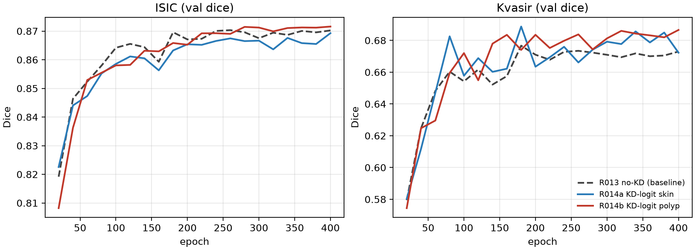

# m3a 队列对比分析:R013 no-KD vs R014a KD-skin vs R014b KD-polyp

生成时间:2026-09-06 23:00(队列完成于 22:49:38,全部 exit=0)
数据来源:`/home/jyr/experiments/code/runs/{r013_noKD_dualdomain, r014a_kd_logit_skin, r014b_kd_logit_polyp}/results.json`(已复制到本目录)

## 0. 口径与协议(读结论前必看)

- **Protocol v2**:每域 eval 前重算 BN 统计;双域交替训练 200 ep/域(共 400 ep);width 40 (0.854M)、lr 1e-4、batch 16、seed 42。
- **评测不对称**:`train_kd.py:384-386` 只在 **kvasir test** 上做最终测试,isic 没有 test split 评测。因此本文中 "isic 数字" 全部是 **val**,"kvasir 数字" 以 **test** 为准。
- **教师参考**:skin 教师 (r004, ResNet-UNet) val Dice 0.9036;polyp 教师 (r005, Swin-UNet) val Dice 0.9188。

## 1. 主结果表

| Run | best val Dice (ep, 选择域) | isic val @400 | kvasir val @400 | kvasir test Dice / IoU / HD95 |
|---|---|---|---|---|
| R013 no-KD 基线 | 0.8703 (260, isic) | 0.8702 | 0.6730 | 0.6782 / 0.5618 / **55.18** |
| R014a KD-logit skin | 0.8693 (400, isic) | 0.8693 | 0.6723 | 0.6596 / 0.5446 / 59.47 |
| R014b KD-logit polyp | 0.6866 (400, kvasir) | **0.8716** | 0.6866 | **0.6830** / 0.5662 / 58.08 |

kvasir test 完整指标:

| Run | Dice | IoU | HD95 | Sens | Spec |
|---|---|---|---|---|---|
| R013 no-KD | 0.6782 | 0.5618 | **55.18** | **0.7199** | 0.9645 |
| R014a KD-skin | 0.6596 | 0.5446 | 59.47 | 0.7096 | 0.9631 |
| R014b KD-polyp | **0.6830** | **0.5662** | 58.08 | 0.7183 | **0.9675** |

## 2. KD 增益(Δ vs R013 基线)

| Run | isic val | kvasir val | kvasir test |
|---|---|---|---|
| R014a KD-skin | −0.0010 | −0.0007 | **−0.0186** |
| R014b KD-polyp | +0.0014 | **+0.0136** (+2.0%) | **+0.0048** (+0.7%) |

## 3. 结论

1. **polyp 教师 KD 有效但幅度很小**:kvasir test +0.5pp、val +1.4pp。注意学生与 polyp 教师差距高达 24pp(0.673 → 0.919),KD 只回收了其中约 1.4pp,logit KD 的转移效率很低。
2. **skin 教师 KD 无增益**:isic val −0.1pp(0.8703 → 0.8693),且 best epoch 从 260 推迟到 400——峰值只在最后一个 eval 点出现,说明 KD 没有带来更优解,只是训练后期的小幅波动;同时对 kvasir test 有 −1.9pp 的**负迁移**。
3. **r014b 的 isic val 0.8716 为三者最高,但不能归因于 KD**:polyp 教师在 isic epoch 上 kd=0.0000(日志确认),该差异是纯训练方差/顺序效应。
4. **效果不对称的合理解释**:KD 对学生的弱域(polyp, 0.67)有小幅帮助、对强域(isic, 0.87)无帮助;且 Dice 增益主要来自 Spec 提升(+0.3pp,减少假阳性),Sens 基本持平。
5. **val/test 不一致信号**:kvasir HD95 上 R014b 的 val 大幅改善(62.7 → 55.2)但 test 反而变差(55.2 → 58.1),说明 val 上的 HD95 改善部分过拟合,写 paper 时不宜用 val HD95 声称边界质量提升。

## 4. 论文口径提醒

- isic 只有 val、kvasir 只有 test 的**评测不对称**必须在方法/实验部分写明,或补做对称评测(isic test + kvasir val 与旧 run r011b/r012b 口径对齐)。
- best-epoch 选择口径:R013 在 ep260、两个 KD run 都在 ep400,若做早停对比需统一规则(如固定 ep200 取 val)。
- R014a 取代 r011b、R014b 取代 r012b 时,注意新数字与旧数字的 eval 修正差异(protocol v2 BN refit)。

## 5. 收敛曲线

(每 20 ep 一次 val eval,共 20 点;左 isic、右 kvasir。可见 R014a 在 isic 上全程未超过 R013 峰值,R014b 在 kvasir 上自 ep~200 起稳定领先 R013。)

## 附:本目录文件

- `compare_m3a.py` — 生成表和图的脚本
- `m3a_convergence.png` / `.svg` — 收敛曲线
- `r013_noKD_dualdomain.results.json` / `r014a_*.results.json` / `r014b_*.results.json` — 原始数据
